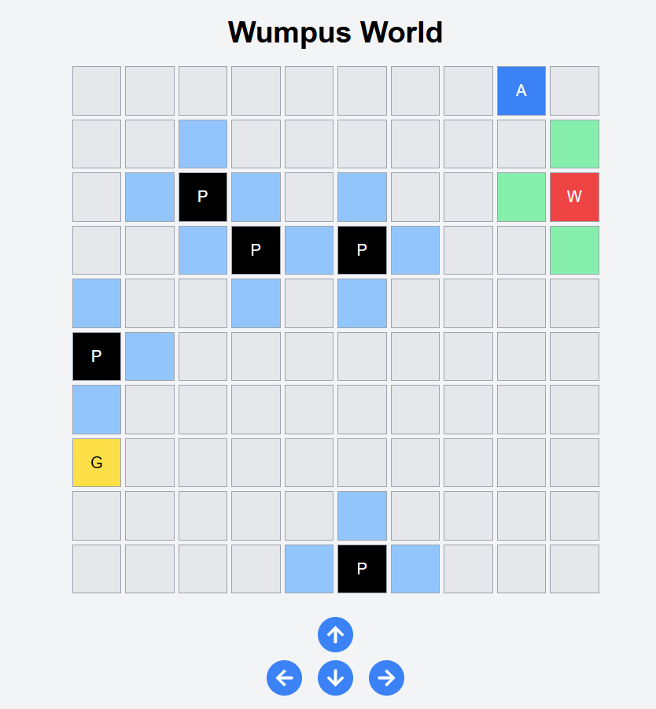

# React Project

This is a simple React project demonstrating a grid-based environment simulation.

## Demo

Here is a preview of the application:



## Features

- Grid-based navigation with logic-based agent movement
- Dynamic placement of elements like pits, gold, and Wumpus
- User interface for navigation and monitoring the agent's state
- Icons for directional movement

## How to Run

1. Clone this repository.
2. Install dependencies:
   ```bash
   npm install
